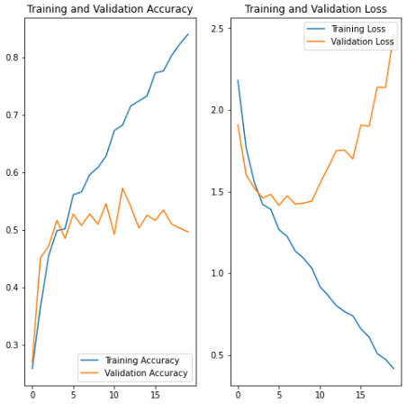
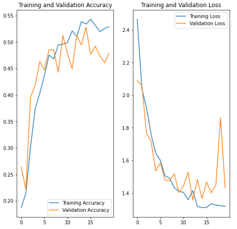
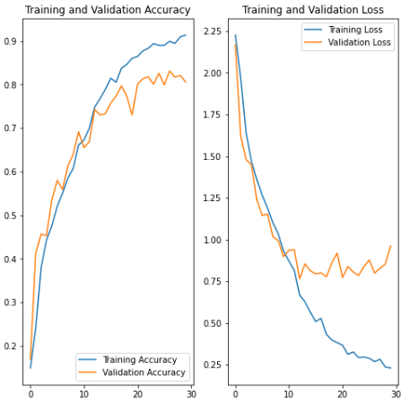

# Project Name
> Melanoma Detection Assignment
Use Convolutional Neural Network (CNN) to classify nine types of skin cancer from outlier lesions images

## Table of Contents
* [General Info](#general-information)
* [Technologies Used](#technologies-used)
* [Conclusions](#conclusions)
* [Acknowledgements](#acknowledgements)

<!-- You can include any other section that is pertinent to your problem -->

## General Information
- Problem statement: To build a CNN based model which can accurately detect melanoma. Melanoma is a type of cancer that can be deadly if not detected early. It accounts for 75% of skin cancer deaths. A solution which can evaluate images and alert the dermatologists about the presence of melanoma has the potential to reduce a lot of manual effort needed in diagnosis.
- The current analysis is based on the "Skin cancer ISIC The International Skin Imaging Collaboration" dataset. It consists of 2357 images of malignant and benign oncological diseases, which were formed from the International Skin Imaging Collaboration (ISIC). All images were sorted according to the classification taken with ISIC, and all subsets were divided into the same number of images.

## Technologies Used
- Keras
- TensorFlow
- Python 3
- Pandas, Numpy, Matplotlib,
- Augmentor

## Conclusions
### Model 1
#### #### Accuracy and Loss for model 1

- Model 1 was trained for 20 epochs with available data
- Observations:
    - The model clearly overfits.
    - The training accuracy is continuously increasing while the validation accuracy is fluctuating around 50%.
    - The loss on training set decreases after each epoch but in case of the validation loss, its increasing after decreasing for few initial epochs.
    - The model memorized the data instead of generalizing and learning real features and general relationships.
  
### Model 2
#### Accuracy and Loss for model 2 - keras augmentation

- Model 2 was trained for 20 epochs with keras built-in data augmentation.
- Following augmentations were used
    - Rotation
    - Zoom
    - Flip - vertical and horizontal
- Observations:
    - The application of data augmentation and dropout layer reduced overfitting.
    - Results on training and validation datasets are much closer.
    - Overall accuracy is not high.

### Model 3
#### Accuracy and Loss for model 3 - Class imbalance changes + Dropout and Batch Normalization

#### Accuracy and Loss for model 3 - Class imbalance changes + Dropout

- Model 3 was trained for 30 epochs 
- Augmentor was used to reduce class imbalance (500 images per class got added)
- Observations:
    - Changes done for data imbalance helped in improving training and validation accuracy.
    - On top of data imbalance changes, tried two options
      - With dropout and batch normalization
      - With only dropout
    - Even though validation accuracy increased, still there is 0.1 gap between training and validation accuracy.

## References
- https://keras.io/guides/
- https://www.tensorflow.org/tutorials/images/data_augmentation
- https://augmentor.readthedocs.io/en/stable/

## Contact
Created by [@sivaprasadt246] - feel free to contact me!

<!-- Optional -->
<!-- ## License -->
<!-- This project is open source and available under the [... License](). -->

<!-- You don't have to include all sections - just the one's relevant to your project -->
